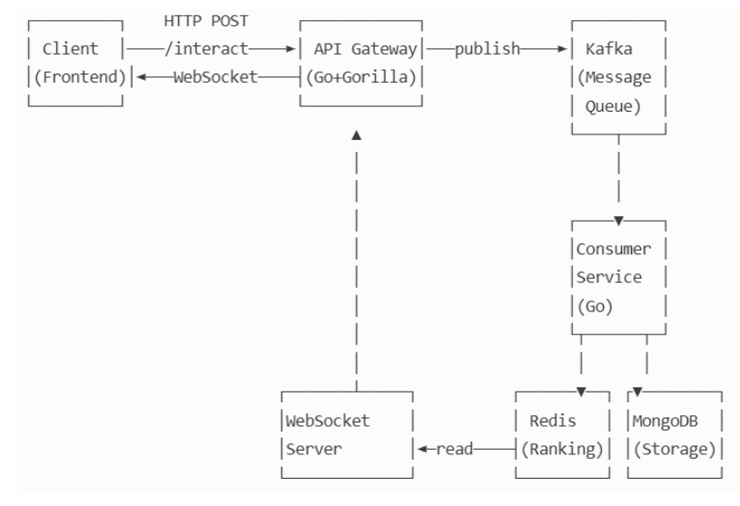

# Real-Time Video Ranking Microservice

## Problem Statement
Develop a microservice to rank videos in real-time based on user interactions.

## 🔁 Workflowhttps://github.com/Vanlv2/test.git

### Client (Frontend)
1. **POST /interact**: Sends user interactions (view, like, comment, share, watch_time) to the backend via API.
2. **WebSocket**: Receives real-time ranked video data from the server.
   - `/ws/videos`: Get the full ranked video list.
   - `/ws/user/{user_id}`: Get a specific user's ranked videos.

### API Gateway (Microservice)
1. Receives `POST /interact`, sends the data to Kafka.

### Kafka (Message Queue)
1. **Topic**: `video_interactions` stores user interaction events.

### Consumer (Microservice)
1. Consumes interaction events from Kafka.
2. Calculates ranking scores based on the interactions.
3. Updates Redis and MongoDB with new ranking data.

### Redis
1. Stores the real-time video ranking in a sorted set (`global_ranking`).

### MongoDB
1. Stores interaction metadata (views, likes, comments, etc.) for long-term analysis.

### WebSocket Server
1. Retrieves data from Redis.
2. Sends the ranked video list to connected clients.

---

## System Architecture

### Detailed Components Description

#### Client
- **POST /interact**: Sends user interactions like view, like, comment, share, watch_time.
- **WebSocket Connections**:
  - `/ws/videos`: Receives the full ranked video list.
  - `/ws/user/{user_id}`: Receives videos specifically ranked for a user.

#### Web Server (Gorilla Mux)
- Handles HTTP requests and WebSocket connections.
- **Endpoints**:
  - `/interact`: Receives interactions from the client, encodes them to JSON, and sends them to Kafka.
  - `/ws/videos`: WebSocket handler to send the full ranked video list (from Redis and MongoDB).
  - `/ws/user/{user_id}`: WebSocket handler to send videos specific to a user.

#### Kafka
- **Topic**: `video_interactions` stores the user interaction events sent from `/interact`.
  
#### Kafka Consumer (in `kafkaConsume`)
- Reads messages from the `video_interactions` topic.
- Updates MongoDB with video interaction data.
- Updates Redis with real-time ranking data (using `ZIncrBy` to update the score in `global_ranking`).
- Sends video changes to `updateChan` for real-time updates via WebSocket.

#### MongoDB
- Stores video metadata such as:
  - `video_id`, `user_id`, `score`, `views`, `likes`, `comments`, `shares`, `watch_time_total`, `watch_time_score`.
- **Function `updateVideoInMongo`**:
  - Creates a new video entry if not existing.
  - Updates existing video details (views, likes, score, etc.) based on the interaction type.

#### Redis
- Stores the global ranking of videos in a sorted set: `global_ranking`.
  - **Key**: `global_ranking`
  - **Member**: `video_id`
  - **Score**: Interaction-based score.
- **Functions `getAllVideos` and `getUserVideos`**: Fetch videos sorted by ranking score from Redis.

#### Update Channel (`updateChan`)
- A Go channel (`chan string`) to transmit `user_id` of videos that have changed.
- **Function `handleMessages`**: 
  - Receives `user_id` from `updateChan`.
  - Updates the video list and pushes the updates via WebSocket:
    - All clients connected to `/ws/videos`.
    - Clients connected to `/ws/user/{user_id}` (if the `user_id` matches).

#### WebSocket Handlers
- **`handleWebSocketVideos`**: Sends the ranked video list (from `getAllVideos`) to clients when they connect or when there's an update.
- **`handleWebSocketUserVideos`**: Sends the ranked videos for a specific user (from `getUserVideos`) when the user connects or when there are updates to that user's videos.

---

## Components

### Technologies

| **Component**        | **Technology**      | **Description**                             |
|----------------------|---------------------|---------------------------------------------|
| Queue                | Kafka               | Buffer interaction events.                  |
| Storage              | Redis ZSet          | Real-time ranking score storage.            |
| Database             | MongoDB             | Stores metadata and long-term interaction data. |
| Real-time Notify     | WebSocket (Gorilla) | Push updates to clients.                    |
| Backend              | Go (mux + goroutines) | Core logic and API processing.             |

### Goals
- **Queue**: Buffer interaction events using Kafka.
- **Storage**: Store real-time ranking scores in Redis using sorted sets (ZSet).
- **Database**: Persist long-term video metadata and interaction data in MongoDB.
- **Realtime Notify**: Push real-time updates to connected clients using WebSocket.
- **Backend**: Handle logic using Go (mux for HTTP routing, goroutines for concurrency).

---

## How to Run the Service

1. **Install dependencies**: Ensure that Kafka, Redis, MongoDB, and Go are properly set up.
2. **Run Kafka**: Start Kafka to handle message queuing.
3. **Run Redis**: Start Redis to manage real-time video ranking data.
4. **Run MongoDB**: Ensure MongoDB is running to store video metadata.
5. **Start the Backend**: Run the Go application with `go run main.go`.
6. **Connect Frontend**: Ensure the frontend is connected to the WebSocket endpoints (`/ws/videos` and `/ws/user/{user_id}`).

---

## Conclusion

This microservice provides real-time video ranking based on user interactions, using Kafka for event buffering, Redis for real-time ranking storage, MongoDB for metadata persistence, and WebSocket for pushing updates to clients. 
